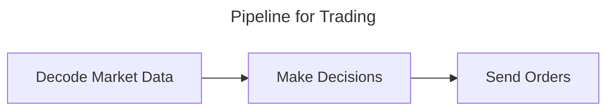
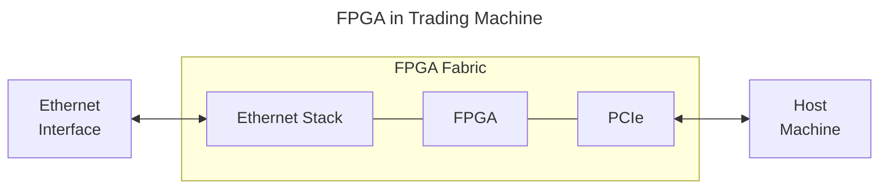

Taking this note to explore how FPGAs can be used in quant trading / HFT (no experience in finance).

References:
[The Data Bus](https://thedatabus.in/hft_interview) (goes into a lot of financial detail which is very interesting and explains it way better than I ever could)

## Why not CPUs?
CPUs have two issues that make them suboptimal for HFT:
1. CPU needs to turn algorithms in to the ISA and execute sequentially, which has a lot of overhead
2. CPU is indeterministic due to the OS running processes and threads
## FPGAs in trading
FPGAs solve indeterminism by being able to know the clock cycles and no ISA overhead, but it does not do complex math well so we still need software.

However, much of the sub-functions that make up this pipeline can be optimized by FPGAs.

# Skills of an HFT FPGA Engineer
Now to the meat of what an FPGA Engineer does in quant
## Data processing

## Ethernet

## HLS Algorithms

## Building tools 