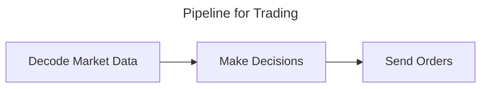
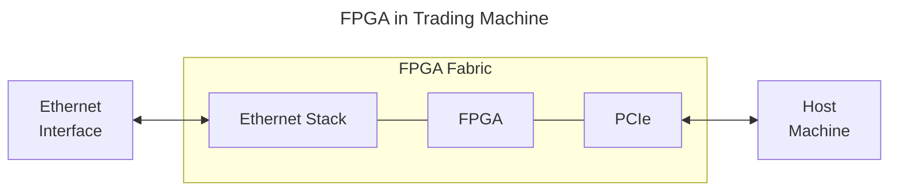

Taking this note to explore how FPGAs can be used in quant trading / HFT (no experience in finance).

I will often quote straight from articles if I don't have a good understanding of what statements mean.

---
References:  
[[1] The Data Bus](https://thedatabus.in/hft_interview) (goes into a lot of financial detail which is very interesting and explains it way better than I ever could)
[\[2\] IMC Trading - IMC Engineering Masterclass 2024](https://youtu.be/RxxGPKhFWCk) 

[^1]: [The Data Bus](https://thedatabus.in/hft_interview)
[^1]: [IMC Engineering Masterclass](https://youtu.be/RxxGPKhFWCk)
---

To start, why are FPGAs used in trading?
## Why not CPUs?
CPUs have two issues that make them suboptimal for certain tasks in HFT:
1. CPU needs to turn algorithms in to the ISA and execute sequentially, which has a lot of overhead
2. CPU is indeterministic due to the OS running processes and threads
## FPGAs in Trading
FPGAs solve indeterminism by being able to know the clock cycles and no ISA overhead, but it does not do complex math well so we still need software (so knowledge of CPU and [[notes/computer-architecture/index|computer organization (ENEE350)]] is great).

However, much of the sub-functions that make up this pipeline can be accelerated by FPGAs.

# Skills of an HFT FPGA Engineer
Now to the meat of what an FPGA Engineer does in quant and what skills will be challenged at the interview stage  
Many of these skills can align with skills mentioned in [[skills|FPGA Skills]]

## RTL Design
> RTL: Register-Transfer Level

**Proficiency in digital logic, Verilog, and microarchitecture development are essential skills in RTL and FPGA design.**

### Interview
RTL is done in the abstraction of hardware description languages (HDL) such as Verilog and VHDL so being able to read, write, debug, and deploy often Verilog code (preferred language) is necessary even at the interview stage.

Unlike other FPGA jobs (often in defense or network industries), interview challenges not just RTL skills but IQ with challenging puzzles as technical problems.  
Alongside puzzles, sometimes assignments are given for the interview: "This often includes implementing the problem statement in RTL and writing code to verify it."[^1]

[More RTL Design Interview Tips](https://thedatabus.in/interview_list)
### Low Latency
An important focus of FPGAs and Software in HFT is achieving low latency.

This is achieved by writing code that takes less cycles to do a task through problem-solving different optimizations and low latency alternatives "while keeping it reasonable enough to be implemented within the timing constraints."[^1]
### [[|State Machine]]
State Machines are very common block used in digital logic (so FPGAs and sometimes software) and can be used for a lot of purposes.

State Machines are fundamentally a set of states and take inputs that transition them to other possible states.
### [[fifo|FIFO]]
> FIFO: First In, First Out

FIFOs additionally are very common in digital logic with both synchronous and asynchronous. You may know FIFO as First In, First Out from queue data structures in software. 

Similarly, FIFOs are used as data buffers and manage pipelines in certain architectures.

FIFOs reduce latency and increase efficiency by allowing data processing to happen without waiting and ensures market data is not lost.
## Verification
Verification is fundamental as compiling of FPGA designs can take days or even weeks thus simulating for early feedback within minutes, resulting in faster development iteration. After simulation further testing can be done on real FPGAs.^2

FPGA teams are typically quite small in HFT firms, so developers and engineers often have to work many different hats to deliver a project, which is great for growth. 

Verification is important because the size of trades mean a single bug could lead to losses for a few years. Thus be comfortable with simulations and debugging through waveforms.

Writing efficient test benches and test cases for your code is invaluable often in **SystemVerilog** and UVM.

Important to note is both design and verification need to be handled by the same person and both skills need to be showcased.
## Networking

## Data processing

## Network

### Ethernet

### PCIe

## HLS Algorithms

## Building tools 